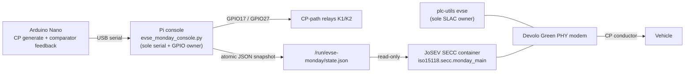

# Software Quickstart — firing up the JoSEV SECC

This guide shows the two ways to run the ISO 15118-2 communication software (the
hardware-adapted EcoG **JoSEV** SECC). It only covers JoSEV; pyPLC / DIN SPEC
70121 is out of scope here.

Pick the mode that matches what you have:

| Mode | You have | What runs | What it proves |
| --- | --- | --- | --- |
| **A — Hardware in the loop** | The custom board, Arduino Nano, Devolo Green PHY modem and a Raspberry Pi | The hardware-adapted SECC (`monday_main`) plus the Pi console, the `plc-utils` SLAC owner and a live packet capture | The full CP + Green PHY + ISO 15118-2 path with a real vehicle, up to the first `PreChargeReq` |
| **B — Software-only simulation** | Any Linux host (or Windows with WSL2) and Docker | Two upstream JoSEV containers, an **SECC** and an **EVCC**, talking over Docker's internal IPv6 network | The ISO 15118-2 DC message flow end to end, in software, with no board and no modem |

> [!CAUTION]
> This is a communication-only laboratory rig, not a charger. It has no HV/DC
> source, insulation monitor, pre-charge stage or energy path. In Mode A you are
> driving a real vehicle's Control Pilot line, so finish the bench checks first
> and **never** enable the PreCharge probe (`MONDAY_PRECHARGE_PROBE=1`) on any
> system that contains an HV/DC path.

---

## Mode A — Hardware in the loop

### How the pieces talk



The SECC never opens the serial port or GPIOs. It only reads the state snapshot
the console writes, so there is exactly one owner of the hardware.

### One-time setup

1. **Prepare the Pi.** Raspberry Pi OS (Debian-based), Python 3, Docker with the
   Compose plugin, and `tmux tcpdump ip ss script stdbuf sha256sum pinctrl`.
2. **Build `open-plc-utils` from source** (`qca/open-plc-utils`) so you have
   `evse`, `plctool` and `plcstat` on the path. There is no stock apt package.
3. **Flash the Arduino** sketch in `software/arduino/evse_cp_feedback_led/` onto
   an Arduino Nano.
4. **Get the upstream SECC.** Clone the EcoG stack at the recorded compatible
   revision, in a checkout of its own:
   ```bash
   git clone https://github.com/EcoG-io/iso15118.git
   cd iso15118
   git checkout 76bf85be572d16adbcd009a985d605622c3b7227
   ```
5. **Apply the project files** from `software/josev-modifications/` into that
   tree with `software/raspberry-pi/install_monday.sh` (review its paths first;
   the validated Pi directory was `~/thesis-monday-real-ev`).
6. **Build the image** `iso15118-secc:latest` from that tree (the compose file
   also uses `redis:6.2.6-alpine`).
7. **Make your local config** from the templates, and fill every `CHANGE_ME`:
   | Template (committed) | Local file (git-ignored) |
   | --- | --- |
   | `software/configuration/.env.example` | `.env.monday-real-ev` |
   | `software/configuration/monday-ops.env.example` | `monday-ops.env` |
   | `software/configuration/slac/evse-monday.example.ini` | `slac/evse-monday.ini` |

   Keep `MONDAY_PRECHARGE_PROBE=0`. Put your Devolo adapter MAC, the SLAC profile
   and its SHA-256, and your PLC network key only in these local files. Never
   commit them.

### Fire it up (each test day)

```bash
# load the ops environment into this shell
set -a; . /path/to/monday-ops.env; set +a

# hardware-independent tests, then readiness checks with the EV DISCONNECTED
python -m pytest software/raspberry-pi/tests
/path/to/monday_ops.sh preflight

# bench-verify State A, State B and the 5% HLC feedback against known loads
# (use the console; see software/raspberry-pi/README.md)

# start everything and open the cockpit
/path/to/monday_ops.sh test-day
```

`test-day` runs the preflight, creates a timestamped run folder, starts the
packet capture, Redis and the SECC, waits for UDP 15118, and opens a four-pane
`tmux` cockpit:

| Pane | Function |
| --- | --- |
| Large left | Console — sole serial/GPIO owner (you drive CP here) |
| Upper right | Decoded CP state + freshness |
| Middle right | `plc-utils` SLAC owner |
| Lower right | Live SECC log |

Reconnect later with `monday_ops.sh cockpit`. When finished, request a session
stop from the console, then:

```bash
/path/to/monday_ops.sh shutdown   # safe CP state, stop capture, collect logs, checksums
```

Only after the bench checks and preflight pass should you follow
`validation/procedures/REAL_EV_COMMUNICATION_TEST_RUNBOOK.md` for the real
vehicle.

---

## Mode B — Software-only simulation (two JoSEV containers)

No board, no modem, no `plc-utils`, no Arduino. This runs the **upstream EcoG
JoSEV** dev stack, where an EVCC container and an SECC container complete a full
ISO 15118-2 DC session over Docker's internal network. It does **not** use this
repo's hardware SECC (`monday_main`), which expects the live state snapshot from
the Pi console.

On Windows, do this inside WSL2 (Ubuntu). On Linux, run it directly.

```bash
# 1. get the upstream stack
git clone https://github.com/EcoG-io/iso15118.git
cd iso15118

# 2. if the image build fails on an end-of-life base, move it to bookworm
grep -rl "buster" *.Dockerfile Dockerfile* docker/ 2>/dev/null \
  | xargs -r sed -i 's/python:3.10.0-buster/python:3.10-bookworm/g'

# 3. select DC charging with EIM (thesis scope)
sed -i 's/evcc_config_eim_ac.json/evcc_config_eim_dc.json/g' .env.dev.docker

# 4. build the SECC and EVCC images (first build takes a few minutes)
make build

# 5. start Redis + SECC + EVCC, and keep a log
make dev 2>&1 | tee josev_dc_session_log.txt

# stop with Ctrl+C
```

The EVCC waits a few seconds for the SECC, then runs SDP discovery and the V2G
message exchange. TLS stays off and payment is external identification (EIM), so
the flow mirrors the thesis session: `SDP → supportedAppProtocol → SessionSetup
→ ServiceDiscovery → PaymentServiceSelection → Authorization →
ChargeParameterDiscovery → CableCheck → PreCharge → PowerDelivery →
CurrentDemand → PowerDelivery → WeldingDetection → SessionStop`. The simulated
EVCC uses the stack's built-in placeholder battery values, which differ from the
real-vehicle capture in the thesis.

---

## Command reference (Mode A, `monday_ops.sh`)

| Command | Purpose |
| --- | --- |
| `preflight` | Read-only readiness checks; needs a clean stopped session |
| `start` | Run folder + packet capture + Redis + SECC |
| `test-day` | `start`, then open the four-pane cockpit |
| `cockpit` | Open or reconnect the cockpit |
| `console` | Interactive Arduino/GPIO console (sole owner) |
| `slac` | The single `plc-utils` EVSE SLAC owner |
| `monitor` / `secc-logs` | Follow decoded CP state / SECC log |
| `status` / `diagnose` | Processes, sockets, CP snapshot, PLC table / layer-by-layer check |
| `stop` | Latched fail-safe STOP, verify relays OFF |
| `collect` / `shutdown` | Gather evidence / safe state + stop all services |

No `monday_ops.sh` command ever produces A, HLC or PWM on the Control Pilot.
Those are deliberate console actions, taken only after the physical setup and CP
state are checked.
